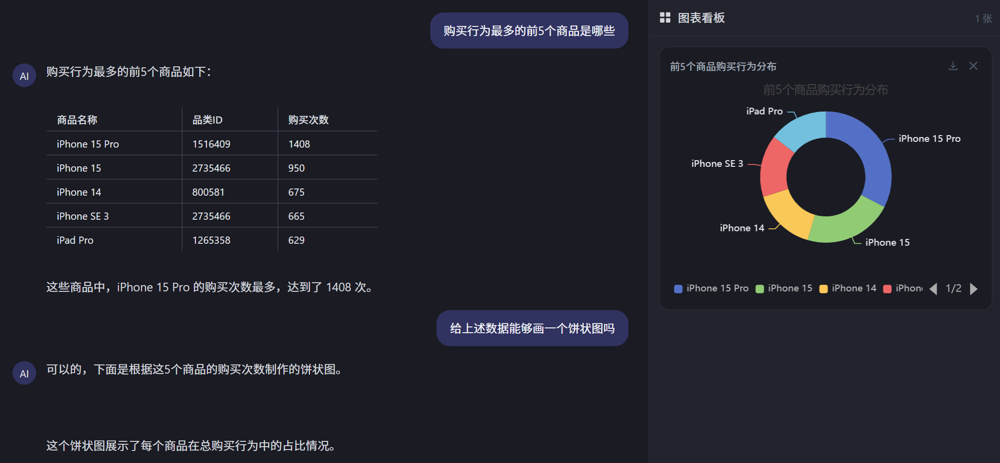

# DataCopilot · 对话式数据分析平台

> 面向业务人员的自然语言取数平台：说一句话，自动写 SQL、跑数、出图表。

基于 **LangGraph 单 Agent ReAct 循环** + **FastAPI SSE 流式** + **Vue3 / ECharts** 构建，
支持 **MySQL / CSV / ClickHouse** 多数据源，内置三层安全防护与自动化评测闭环。

---

## 📸 界面预览



---

## ✨ 功能特性

- **自然语言 → SQL → 图表**：用户用中文提问，Agent 自动理解意图、生成 SQL、查询数据、渲染 ECharts 图表
- **多数据源**：MySQL（OLTP）+ DuckDB 动态注册 CSV（零配置分析）+ ClickHouse（1 亿行真实大数据），Agent 按可用性自动回退
- **ReAct 循环**：LangGraph 状态图编排，5 个工具（表结构 / MySQL / CSV / ClickHouse / Python 沙箱）
- **意图分类**：入口语义分类（qwen-turbo），闲聊/领域外自动友好拒答，不调用主模型
- **断点恢复**：工具失败时 interrupt 暂停，用户可"继续执行"从断点续跑，已完成步骤不重跑
- **记忆管理**：短期记忆 SQLite 持久化 + 滚动摘要（便宜模型压缩历史，控制 token 成本）
- **SSE 流式**：思考过程逐字推送、工具调用日志、图表渲染事件实时到达前端
- **图表导出**：ECharts PNG 一键下载（纯前端，2 倍高清）
- **安全纵深**：Prompt Injection 正则 + 意图分类 + SQL 白名单黑名单（按引擎定制）+ Python 沙箱进程隔离

---

## 🛠 技术栈

| 层 | 技术 |
|---|---|
| 后端 | Python · FastAPI · LangGraph · LangChain · SSE |
| Agent | LangGraph ReAct 循环 · Qwen (DashScope) · 多工具编排 |
| 数据 | MySQL · DuckDB · ClickHouse · SQLAlchemy |
| 前端 | Vue 3 · Vite · ECharts · Tailwind |
| 安全 | Prompt Injection 检测 · SQL 双校验 · subprocess 沙箱 |

---

## 📁 项目结构

```
project2/
├── backend/                 # 后端（FastAPI + LangGraph）
│   ├── agent/               # Agent 核心：状态/节点/图/提示词/分类器/摘要器
│   ├── chart/               # 图表意图映射器（简化意图 → ECharts option）
│   ├── tools/               # 5 个工具 + SQL 安全校验公共模块
│   ├── data/                # 模拟数据（CSV + SQL + 生成脚本）
│   ├── script/              # 自动化评测脚本（期望值对照）
│   ├── main.py              # FastAPI 入口（SSE 流式接口）
│   ├── config.py            # 配置加载（.env）
│   └── .env.example         # 环境变量模板
├── frontend/                # 前端（Vue 3 + Vite + ECharts）
│   └── src/
│       ├── App.vue          # 主界面（SSE 解析、会话管理）
│       └── components/      # 聊天面板/思考面板/图表卡片
└── .gitignore
```

---

## 🚀 快速开始

### 环境要求

- Python 3.10+
- Node.js 18+
- （可选）MySQL / Docker（ClickHouse 大数据）

### 1. 配置后端

```bash
cd backend
cp .env.example .env        # 填入你的 DASHSCOPE_API_KEY（阿里云百炼获取）
pip install -r requirements.txt
```

### 2. 启动后端

```bash
python -m uvicorn main:app --port 8000 --reload
```

### 3. 启动前端

```bash
cd frontend
npm install
npm run dev
```

浏览器打开 `http://localhost:3000`，试试提问：

> "7月各渠道销售额对比，画个柱状图"

---

## 🔍 评测结果

基于自建 **21 组自动化评测用例**（期望值对照，非"有数字即过"）：

| 套件 | 通过率 | 判定方式 |
|---|---|---|
| 图表意图解析（8 题） | 100% | 收到 chart 事件 + 配置可渲染 |
| 查询回答（8 题） | 100% | 回答数字与真实 SQL 期望值容差匹配 |
| 安全拦截（5 题） | 100% | 入口拦截或 LLM 安全拒绝 |

```bash
cd backend
python script/evaluate_agent.py       # 完整 21 题
python script/evaluate_agent.py --quick  # 快速 9 题
```

---

## 🔒 安全设计（三层纵深）

```
① 入口层: Prompt Injection 正则（中英 20 条）+ 意图分类（语义拒答）
② 语句层: SQL 白名单 + 黑名单（统一公共模块，按引擎定制词表）
③ 执行层: Python 沙箱（subprocess 隔离 + 禁 open/import/网络 + 15s 超时）
```

设计哲学：**攻击者必须同时突破所有层；即使注入成功，系统也没有武器可用**。

---

## 📦 数据说明

- **模拟数据**（`backend/data/`）：3 表星型 Schema（渠道/商品/销售），MySQL + CSV 双份
- **可选大数据**：接入 ClickHouse 后可加载真实用户行为数据集（1 亿行），Agent 亿级聚合秒级返回

---
## 📄 License

MIT
